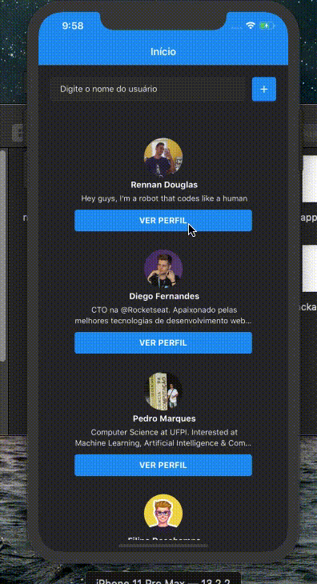

<h3 align="center"> GitHunt, application made with React. </h3>

<p align="center"> 
    application made for study, made with ReactJs in the web part 
    and React Native in the mobile part.
</p>

## 💻 Web Application

<h1 align="center">
    
</h1>

<h3 align="center">
Search Github public API repositories and add them to the
application, so you can view their issues inside it.
</h3>

### ❗️ Requisites

- [Node](https://nodejs.org/en/)
- [Yarn](https://yarnpkg.com/lang/en/)

### ⚡️ Start

To start application, run:

```bash
$ cd frontend
$ yarn install
$ yarn start
```

<h1 align="center">
    
</h1>

## 💻 Mobile Application

<h1 align="center">
    
</h1> <br /> <br />

<h3 align="center">
Search for users of the Github API and each one,
see which repositories he has favorited.
</h3>

### ❗️ Requisites

- [Node](https://nodejs.org/en/)
- [react-native-cli](https://github.com/react-native-community/cli)
- [Yarn](https://yarnpkg.com/lang/en/)

#### 👾 Android

- [Android Sdk](https://developer.android.com/studio)

#### 🍎 Ios

- [XCode](https://developer.apple.com/xcode/)

### ⚡️ Start

To start application, run:

```bash
$ cd mobile
$ yarn install
```

#### 🍎 Ios

```bash
$ react-native run-ios
```

#### 👾 Android

```bash
$ react-native run-android
```

<h1 align="center">
    
</h1>
